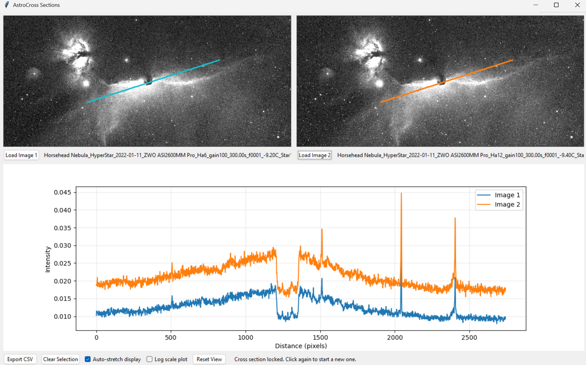

# AstroCrossSections

AstroCrossSections is a small Tkinter desktop app for loading two images and extracting matched line
cross sections. It supports common image formats and astronomical data, and plots both profiles
on the same graph for quick comparison.



## Features

- Load two images (PNG/JPEG/TIF/BMP, FITS, XISF)
- RGB images are flattened to luminance for analysis
- Click two points on Image 1 to draw a line and sample both images
- Live preview while moving the mouse before the second click
- Plot both cross sections together (linear or log scale)
- Export cross section data to CSV
- Synchronized zoom and pan across both images
- Optional auto-stretch display toggle (does not affect measurements)

## Requirements

- Python 3
- Packages: `numpy`, `pillow`, `matplotlib`
- Optional: `astropy` for FITS, `xisf` for XISF

## Install

```powershell
python -m venv .venv
.venv\Scripts\activate
python -m pip install --upgrade pip
pip install numpy pillow matplotlib astropy xisf
```

If you do not need FITS or XISF support, you can omit `astropy` or `xisf`.

## Run

```powershell
python AstroCross.py
```

## Usage

1. Click **Load Image 1** and **Load Image 2**.
2. Click two points on Image 1 to define the cross section.
3. Move the mouse after the first click to preview the line, then click again to lock it.
4. Click a third time to reset and start a new selection.
5. Use **Export CSV** to save the distance/intensity table.

### Controls

- Mouse wheel over an image: zoom (synchronized)
- Right-click + drag: pan (synchronized)
- **Reset View**: return to fit-to-window view
- **Auto-stretch display**: toggle between raw and stretched display
- **Log scale plot**: toggle linear vs log y-axis

## Notes

- The plot and CSV always use the original image data, not the display stretch.
- Image 2 is sampled using a proportional mapping of Image 1 coordinates when sizes differ.

## License

See `LICENSE`.
