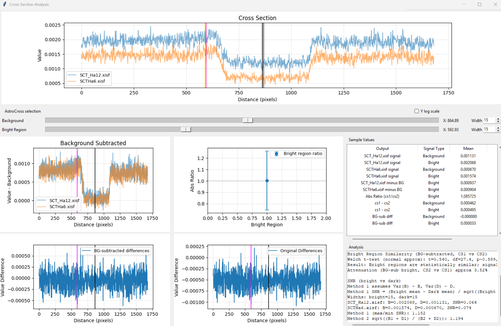

# AstroCrossSections

AstroCrossSections is a Tkinter desktop tool for comparing two astrophotography images by sampling line cross sections, plotting the results, and running follow-up signal analysis.

See the demo video: https://youtu.be/OwB1C-wKpCU




## What this project includes

- `AstroCross.py`: main image comparison app.
- `Analysis.py`: analysis viewer for cross-section CSV data (also opened directly from `AstroCross.py` via the **Analyze** button).

## Feature highlights

- Load two images in PNG/JPEG/TIF/BMP, FITS, or XISF.
- RGB handling: choose luminance conversion or keep RGB channels.
- Matched cross-section sampling with bilinear interpolation on both images.
- Live line preview while selecting points.
- Synchronized zoom/pan between image panels.
- Responsive display downsampling for large images (measurement still uses original data).
- Optional STF-style auto-stretch for display only.
- Registration diagnostics using phase cross-correlation (`dx`, `dy`, `err` in status bar).
- One-click alignment of Image 2 to Image 1 with `astroalign`.
- Automatic center-crop to a common size for pixel-matched comparisons.
- Cross-section plotting in linear/log y-scale.
- Histogram mode with log-spaced bins and per-image median markers.
- CSV export for cross sections and histograms (including RGB channel columns).
- Built-in analysis window launch from current selection.

## Analysis window features (`Analysis.py`)

- Open exported cross-section CSV files directly.
- Select background and bright regions with center and width controls.
- Multi-plot view includes cross section, background-subtracted cross section, absolute bright-region ratio (error bars), and original/background-subtracted difference plots.
- Summary table with mean, standard deviation, and coefficient of variation.
- Text summary with assumptions, Welch-style comparison output, attenuation estimate, and SNR factor methods.
- Right-click plot menu supports Copy Graph, Reset Axes, Synchronize X Axis, and per-plot Y-log toggle.
- `pywin32` enables direct image clipboard copy for Copy Graph on Windows.

## Requirements

- Python 3.10+
- Required packages: `numpy`, `pillow`, `matplotlib`
- Optional package `astropy` for FITS support.
- Optional package `xisf` for XISF support.
- Optional package `scikit-image` for registration diagnostics.
- Optional package `astroalign` for image alignment.
- Optional package `pywin32` for direct image clipboard copy in the analysis viewer.

## Install

```powershell
python -m venv .venv
.venv\Scripts\activate
python -m pip install --upgrade pip
pip install numpy pillow matplotlib astropy xisf scikit-image astroalign pywin32
```

Install only the optional packages you need.

## Run

```powershell
python AstroCross.py
```

Optional standalone analysis viewer:

```powershell
python Analysis.py
```

## Main workflow (`AstroCross.py`)

1. Load **Image 1** (this enables **Image 2**).
2. If RGB, choose luminance or RGB mode.
3. Load **Image 2** (uses the same color mode as Image 1).
4. Review registration info in the status bar.
5. Click two points on Image 1 to define the sampling line.
6. Use **Log scale plot** or **Histograms** as needed.
7. Use **Export CSV** to save cross-section or histogram data.
8. Use **Analyze** (cross-section mode only) to open the analysis window on the current selection.

## Build Windows executable

```powershell
pyinstaller --clean --noconfirm AstroCross.spec
```

The spec file builds `dist/AstroCross.exe` and also creates `dist/AstroCross-win64.zip`.

## License

See `LICENSE`.
